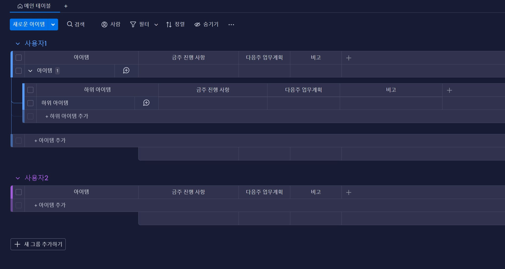

# MondayUtill

## Overview
Monday.com API를 사용하여 특정 board의 정보를 가져와 CSV에 저장하는 app


## Preparation
* git clone 후 root folder에서 종속성 설치
```
pip install -r requirements.txt
```

* 개인 계정 정보와 redirect url이 들어있는 config.json을 root folder에 추가로 작성해야 함
* redirection url은 OAuth2.0에 필수적인 요소로, 이 프로젝트에서는 자세히 다루지 않음 (정적 페이지 제작 후 사용 중. 상용 OAuth 로그인 서비스 페이지 사용해도 됨)
```
//config.json
{
    "client_id" : "your_monday_api_app_public",
    "client_secret" : "your_monday_api_app_secrit",
    "redirect_uri" : "https://your_redirect_url"
}
```


## Getting Start
### Table 구조

### 요청 Quary 구조
```
query {
  boards (ids: [your_board_id]) {
    name
    state
    items_page {
      items {
        group{
          title
        }
        name
        column_values{
          text
        }
        subitems {
          name
          column_values {
            text
          }
        }
      }
    }
  }
}
```

### 실행
* 해당 보드의 url parameter 가장 마지막의 파라미터(숫자)를 [your_board_id]에 넣음
```
python GetMondayItem.py --board_id [your_board_id]
```
* 실행 하면 등장하는 redirection url을 브라우저에서 실행하여 인증코드를 받음
* 해당 redirection url에서 나온 인증코드를 cli창에 입력
### 결과
'CSV 파일로 저장되었습니다:' 로그와 함께, root folder에 해당 board 제목의 CSV 파일 생성